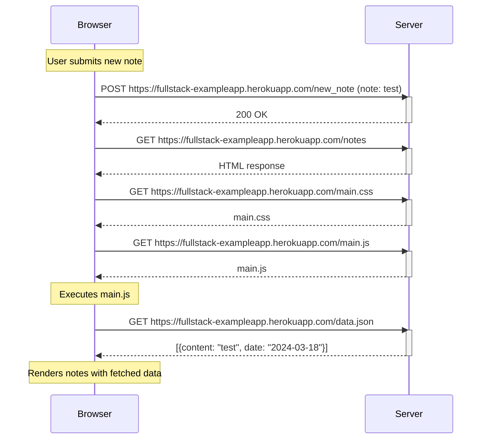

```mermaid
    sequenceDiagram
    participant Browser
    participant Server

    Note over Browser: User submits new note
    Browser->>Server: POST https://fullstack-exampleapp.herokuapp.com/new_note (note: test)
    activate Server
    Server-->>Browser: 200 OK
    deactivate Server

    Browser->>Server: GET https://fullstack-exampleapp.herokuapp.com/notes
    activate Server
    Server-->>Browser: HTML response
    deactivate Server

    Browser->>Server: GET https://fullstack-exampleapp.herokuapp.com/main.css
    activate Server
    Server-->>Browser: main.css
    deactivate Server

    Browser->>Server: GET https://fullstack-exampleapp.herokuapp.com/main.js
    activate Server
    Server-->>Browser: main.js
    deactivate Server

    Note over Browser: Executes main.js
    Browser->>Server: GET https://fullstack-exampleapp.herokuapp.com/data.json
    activate Server
    Server-->>Browser: [{content: "test", date: "2024-03-18"}]
    deactivate Server

    Note over Browser: Renders notes with fetched data
```
