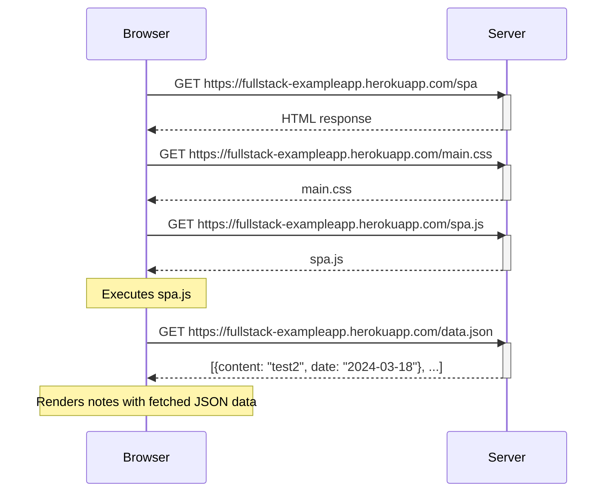

```mermaid
    sequenceDiagram
    participant Browser
    participant Server

    Browser->>Server: GET https://fullstack-exampleapp.herokuapp.com/spa
    activate Server
    Server-->>Browser: HTML response
    deactivate Server

    Browser->>Server: GET https://fullstack-exampleapp.herokuapp.com/main.css
    activate Server
    Server-->>Browser: main.css
    deactivate Server

    Browser->>Server: GET https://fullstack-exampleapp.herokuapp.com/spa.js
    activate Server
    Server-->>Browser: spa.js
    deactivate Server

    Note over Browser: Executes spa.js
    Browser->>Server: GET https://fullstack-exampleapp.herokuapp.com/data.json
    activate Server
    Server-->>Browser: [{content: "test2", date: "2024-03-18"}, ...]
    deactivate Server

    Note over Browser: Renders notes with fetched JSON data

```
