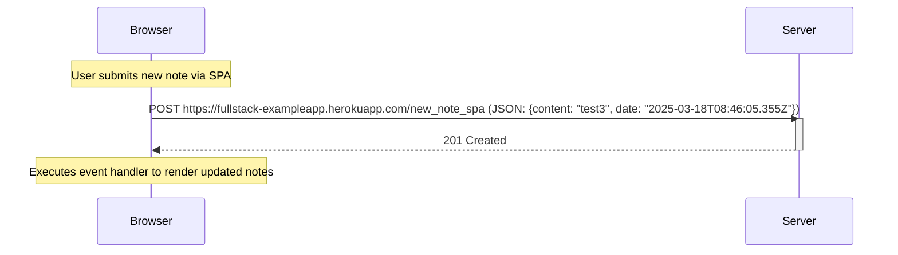

```mermaid
sequenceDiagram
    participant Browser
    participant Server

    Note over Browser: User submits new note via SPA
    Browser->>Server: POST https://fullstack-exampleapp.herokuapp.com/new_note_spa (JSON: {content: "test3", date: "2025-03-18T08:46:05.355Z"})
    activate Server
    Server-->>Browser: 201 Created
    deactivate Server

    Note over Browser: Executes event handler to render updated notes
```
